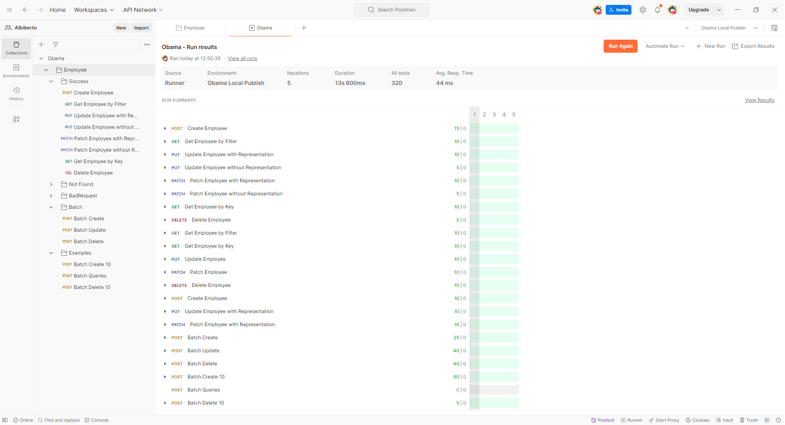

# Obama

## Introduction

The solution is an OData 8 API that manages and exposes a controller for `Employee` and another object `Role`. The `Employee` object has the following fields: `Id`, `GivenName`, `FamilyName`, `Mail`, and `Role`. The `Role` object has the fields: `Id`, `Name`, and `Enabled`.

The goal of the project is to provide an easy-to-launch version of the API, featuring a single controller. The strength of the project lies in the Postman collections, which are used both to test the API and to provide an overview of the functionality and structure of OData calls. Additionally, it includes batch operations, which are very convenient for reducing round trips. In the `examples` folder of the Postman collections, there are several batch examples for querying the APIs, particularly GET requests.

## Prerequisites

- .NET 8 SDK installed
- SQL Server LocalDB installed
- Postman installed

## Running the Application

### Method 1: Rider

1. Open the solution with JetBrains Rider.
2. Set `http` profile
3. Run the application (Ctrl + F5).
4. The application will start on port 5214.
5. In Postman, select the `Obama Debug` environment.
6. Execute the requests in the collection.

### Method 2: Terminal

1. Open the terminal and navigate to the `Obama` folder.
    ```sh
    cd src/Obama
    ```
2. Build and run the application:
    ```sh
    dotnet build
    dotnet run
    ```
3. The application will start on port 5214.
4. In Postman, select the `Obama Debug` environment.
5. Execute the requests in the collection.

### Method 3: Publishing

1. Publish the application to the `dist` folder using the script `publish.ps1`:
    ```sh
    ./publish.ps1
    ```
2. Navigate to the `dist` folder and run the executable:
    ```sh
    cd dist
    ./Obama.exe
    ```
3. The application will start on port 5000.
4. In Postman, select the `Obama Local Publish` environment.
5. Execute the requests in the collection.

## Development Environment Setup

If the environment variable `ASPNETCORE_ENVIRONMENT` is set to `Development`, the application will automatically create a database named `Obama` upon startup. This database will contain two entities: `Employee` and `Role`.

- **Employee**: This entity will be populated with 50 random employees using the Bogus library.
- **Role**: This entity will be populated with 4 random roles using the Bogus library.

This setup ensures that the database is pre-populated with sample data for testing and development purposes.

## Postman Collection

The Postman collection located in the `postman` folder at the root of the project contains a series of requests to test the API. Additionally, the `examples` folder contains sample OData requests and tests. The collection is structured into folders as follows:

| Folder    | Description |
|-----------|-------------|
| Success   | Contains requests that should succeed. The logical flow includes creating an employee with POST, retrieving the newly created user with a filtered GET, updating the user with PUT (returning the updated representation), updating the user with PUT (returning only the confirmation of the update), modifying the user with PATCH (returning the updated representation), further modifying the user with PATCH (returning only the confirmation of the update), retrieving the employee by ID with GET, and finally deleting the user with DELETE. |
| NotFound  | Contains requests that should return a 404 error. |
| BadRequest| Contains requests that should return a 400 error. |
| Batch     | Contains batch requests for creating multiple users with POST, verifying them with GET, modifying them with PUT and PATCH, further verifying with GET, deleting them with DELETE, and verifying the deletion with GET (returning not found). |
| Examples  | Creates 10 users with POST, runs a series of GET queries on these users to demonstrate OData functionality, and finally deletes the 10 users created earlier, all in batch operations. |


